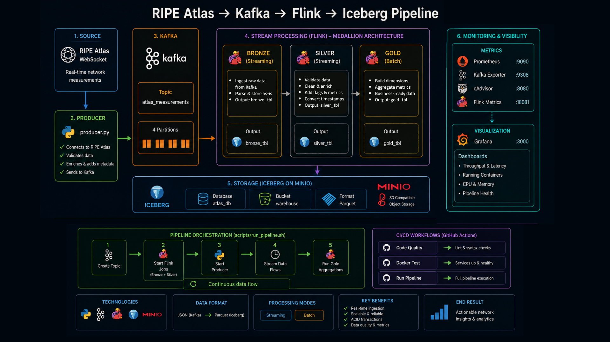

# RIPE Atlas → Kafka → Flink → Iceberg Streaming Pipeline

A production-grade streaming data pipeline that ingests real-time network measurements from [RIPE Atlas](https://atlas.ripe.net/), processes them through Apache Kafka and Apache Flink, and stores them in Apache Iceberg tables on MinIO (S3-compatible storage) — following the **Medallion Architecture**.

---

## Table of Contents

- [RIPE Atlas → Kafka → Flink → Iceberg Streaming Pipeline](#ripe-atlas--kafka--flink--iceberg-streaming-pipeline)
  - [Table of Contents](#table-of-contents)
  - [Architecture Overview](#architecture-overview)
  - [Project Structure](#project-structure)
  - [Medallion Layers](#medallion-layers)
  - [Components](#components)
    - [Kafka Producer — `kafka/`](#kafka-producer--kafka)
    - [Pipeline Scripts — `scripts/`](#pipeline-scripts--scripts)
    - [Flink SQL Jobs — `flink/sql-jobs/`](#flink-sql-jobs--flinksql-jobs)
    - [Airflow DAGs — `dags/`](#airflow-dags--dags)
  - [CI/CD Workflows](#cicd-workflows)
  - [Monitoring \& Observability](#monitoring--observability)
  - [Prerequisites](#prerequisites)
  - [Getting Started](#getting-started)
  - [Docker Services](#docker-services)
  - [Service UIs](#service-uis)

---

## Architecture Overview



```
RIPE Atlas WebSocket
        │  wss://atlas-stream.ripe.net/stream/
        ▼
┌─────────────────────────────────┐
│           producer.py           │
│  • Validate (prb_id, timestamp) │
│  • Enrich (event_id, ingest_ts) │
│  • Publish keyed by prb_id      │
└────────────────┬────────────────┘
                 │
                 ▼
┌─────────────────────────────────┐
│  Kafka: atlas_measurements      │
│         (4 partitions)          │
└────────┬──────────┬─────────────┘
         │          │
         ▼          ▼
    Bronze Job   Silver Job ──► Gold Job
    (streaming)  (streaming)    (batch)
         │          │              │
         └──────────┴──────────────┘
                    │
                    ▼
       Iceberg Tables on MinIO (Parquet)
       atlas_db  •  s3a://atlasevents/warehouse/
                    │
                    ▼
       Prometheus ◄── Kafka Exporter / cAdvisor / Flink
                    │
                    ▼
              Grafana Dashboards
```

---

## Project Structure

```
event-streaming/
│
├── .github/
│   ├── workflows/
│   │   ├── ci-code-quality.yml       # Lint & syntax checks
│   │   ├── ci-docker-test.yml        # Docker services integration test
│   │   └── cd-run-pipeline.yml       # Full pipeline run with real secrets
│   └── README.md                     # ← CI/CD docs
│
├── kafka/
│   ├── producer.py                   # WebSocket → Kafka producer
│   └── README.md                     # ← Kafka producer docs
│
├── flink/
│   ├── sql-jobs/
│   │   ├── bronze-job.sql            # Raw ingestion from Kafka
│   │   ├── silver-ping-job.sql       # Cleaning & enrichment
│   │   └── gold-job.sql              # Aggregations & business KPIs
│   └── sql-client/
│       ├── Dockerfile                # Custom Flink SQL client image
│       └── flink-conf.yaml           # Flink client configuration
│
├── scripts/
│   ├── create_kafka_topic.sh         # Creates atlas_measurements topic
│   ├── run_kafka_producer.sh         # Runs producer.py in venv
│   ├── run_bronze_job.sh             # Submits Bronze Flink SQL job
│   ├── run_silver_job.sh             # Submits Silver Flink SQL job
│   ├── run_gold_job.sh               # Submits Gold Flink SQL job
│   ├── run_pipeline.sh               # End-to-end orchestrator
│   └── README.md                     # ← Scripts docs
│
├── dags/                             # Airflow DAG definitions
├── logs/                             # Airflow logs
│
├── prometheus/
│   └── prometheus.yml                # Scrape config (Flink, Kafka, cAdvisor)
│
├── grafana/
│   └── provisioning/                 # Grafana dashboard definitions
│
├── docker-compose.yml                # All services
├── requirements.txt                  # Python dependencies
├── .env.example                      # Environment variables template
└── README.md                         # ← You are here
```

---

## Medallion Layers

| Layer | Contents | Mode | Flink Job |
|---|---|---|---|
| **Bronze** | Raw data as received — no transformations | Streaming (continuous) | `bronze-job.sql` |
| **Silver** | Validated, enriched, classified (IPv4/v6, packet loss, success flags, timestamps) | Streaming (continuous) | `silver-ping-job.sql` |
| **Gold** | Business-level aggregates — daily averages, availability rates, failure rates, latency | Batch (scheduled) | `gold-job.sql` |

---

## Components

### Kafka Producer — [`kafka/`](./kafka/README.md)

A Python service that streams live measurement events from RIPE Atlas into Kafka.

- Connects to `wss://atlas-stream.ripe.net/stream/`
- Validates each payload — requires `prb_id` and `timestamp`
- Enriches with `event_id` (UUID) and `ingestion_time` (UTC)
- Publishes to topic `atlas_measurements`, keyed by `prb_id`

→ See [`kafka/README.md`](./kafka/README.md) for full details.

---

### Pipeline Scripts — [`scripts/`](./scripts/README.md)

Shell scripts to create the Kafka topic, submit Flink jobs, and orchestrate the full pipeline.

| Script | Purpose |
|---|---|
| `create_kafka_topic.sh` | Creates `atlas_measurements` (4 partitions) |
| `run_kafka_producer.sh` | Sets up venv and runs `producer.py` |
| `run_bronze_job.sh` | Submits Bronze job (detached) |
| `run_silver_job.sh` | Submits Silver job (detached) |
| `run_gold_job.sh` | Submits Gold job (foreground) |
| `run_pipeline.sh` | Runs all steps in order |

**`run_pipeline.sh` flow:**

```
1. Create Kafka topic
2. Start Bronze + Silver Flink jobs (background)
3. Start Kafka producer  ← data starts flowing
4. Wait 10s for flush
5. Run Gold aggregations
6. Cleanup
```

→ See [`scripts/README.md`](./scripts/README.md) for full details.

---

### Flink SQL Jobs — [`flink/sql-jobs/`](./flink/sql-jobs/)

Jobs run inside the `sql-client` container (custom Flink SQL client built from `flink/sql-client/Dockerfile`).

| Job | Input | Output | Mode |
|---|---|---|---|
| `bronze-job.sql` | Kafka (`atlas_measurements`) | `atlas_db.bronze_measurements` | Detached |
| `silver-ping-job.sql` | Bronze Iceberg table | `atlas_db.silver_ping_measurements` | Detached |
| `gold-job.sql` | Silver Iceberg table | `atlas_db.gold_network_facts` + dimension tables | Foreground |

Iceberg metadata is backed by **PostgreSQL** (`postgres-iceberg` on port `5433`) via the REST catalog (`iceberg-rest` on port `8181`). Data is stored as Parquet in MinIO at `s3://warehouse/`.

---

### Airflow DAGs — [`dags/`](./dags/README.md)

The pipeline can also be orchestrated end-to-end via **Apache Airflow** as an alternative to running `run_pipeline.sh` manually.

The DAG runs the same steps in order:

1. Verify mounted scripts and Docker access inside the Airflow container
2. Create Kafka topic
3. Start Bronze Flink streaming job
4. Start Silver Flink transformation job
5. Start Kafka producer — data starts flowing
6. Wait for sufficient Silver data (`TimeDeltaSensor`)
7. Execute Gold aggregation job

The `TimeDeltaSensor` ensures the Gold layer only runs after enough Silver data has been generated — no manual timing needed.

Airflow UI is available at **http://localhost:8087** (credentials from `.env`).

→ See [`dags/README.md`](./dags/README.md) for full DAG details.

---

## CI/CD Workflows

Three GitHub Actions workflows covering quality gates and deployment.

| Workflow | Trigger | Purpose |
|---|---|---|
| `ci-code-quality.yml` | Every `push` and `pull_request` | Lint Python, validate YAML/SQL syntax |
| `ci-docker-test.yml` | `pull_request` only | Verify all Docker services are healthy |
| `cd-run-pipeline.yml` | `push` to `feature/CI` | Run full pipeline with real GitHub Secrets |

→ See [`.github/README.md`](./.github/README.md) for full details including required secrets.

---

## Monitoring & Observability

| Component | Role | Port |
|---|---|---|
| Prometheus | Metrics collection | 9090 |
| Grafana | Dashboard visualization | 3000 |
| Kafka Exporter | Kafka broker metrics | 9308 |
| cAdvisor | Container resource usage | 8080 |

Prometheus scrapes Flink, Kafka, and cAdvisor every **15 seconds**.

→ See [`prometheus/README.md`](./prometheus/README.md) for scrape config details.

---

## Prerequisites

| Tool | Version | Purpose |
|---|---|---|
| Docker | 20.10+ | Container runtime |
| Docker Compose | 2.0+ | Multi-container orchestration |
| Python | 3.8+ | Running producer locally |

**Recommended hardware:** 4+ CPU cores, 8+ GB RAM, 20+ GB free disk.

---

## Getting Started

```bash
# 1. Clone
git clone https://github.com/salma-nour-eldeen6/event-streaming.git
cd event-streaming

# 2. Set up environment
cp .env.example .env
# Edit .env with your credentials

# 3. Start all services
docker compose up -d

# 4. Wait for readiness
curl http://localhost:18081                    # Flink
curl http://localhost:9000/minio/health/live  # MinIO
```

**Option A — Run via Airflow (recommended):**

Open http://localhost:8087, log in with your admin credentials, and trigger the pipeline DAG. Airflow handles step ordering and waits automatically between stages using `TimeDeltaSensor`.

**Option B — Run step by step:**

```bash
bash scripts/create_kafka_topic.sh
bash scripts/run_bronze_job.sh
bash scripts/run_silver_job.sh
bash scripts/run_gold_job.sh
bash scripts/run_kafka_producer.sh
```

**Verify data in Iceberg:**

```bash
# Browse MinIO
docker exec mc mc ls minio/warehouse/

# Query via Flink SQL Client
docker exec -it sql-client ./bin/sql-client.sh
```

```sql
SELECT * FROM atlas_db.bronze_measurements LIMIT 10;
SELECT * FROM atlas_db.silver_ping_measurements LIMIT 10;
SELECT probe_id, avg_latency, available_percent
FROM atlas_db.gold_network_facts LIMIT 10;
```

---

## Docker Services

All services run on the `data-pipeline` bridge network (`172.23.0.0/24`).

| Container | Image | Port(s) | Purpose |
|---|---|---|---|
| `postgres-airflow` | postgres:13 | `${POSTGRES_PORT}` | Airflow metadata DB |
| `airflow-webserver` | apache/airflow:2.7.3-python3.10 | `8087` → 8080 | Airflow UI & API |
| `airflow-scheduler` | apache/airflow:2.7.3-python3.10 | — | DAG scheduling |
| `airflow-init` | apache/airflow:2.7.3-python3.10 | — | DB migration & admin user setup |
| `zookeeper` | confluentinc/cp-zookeeper:7.5.0 | `2181` | Kafka coordination |
| `kafka` | confluentinc/cp-kafka:7.5.0 | `9094`, `9404` | Message broker |
| `flink-jobmanager` | flink:1.18.1-scala_2.12-java11 | `18081` | Flink REST API & job coordination |
| `flink-taskmanager` | flink:1.18.1-scala_2.12-java11 | — | Job execution (4 task slots) |
| `sql-client` | custom (see `flink/sql-client/Dockerfile`) | — | Flink SQL job submission |
| `minio` | minio/minio | `9000` (API), `9001` (console) | Object storage (Parquet/Iceberg) |
| `mc` | minio/mc | — | MinIO client — creates `warehouse` bucket |
| `postgres-iceberg` | postgres:13 | `5433` → 5432 | Iceberg REST catalog metadata DB |
| `iceberg-rest` | tabulario/iceberg-rest | `8181` | Iceberg REST catalog |
| `kafka-ui` | provectuslabs/kafka-ui | `8088` → 8080 | Browse Kafka topics & messages |
| `kafka-exporter` | danielqsj/kafka-exporter | `9308` | Kafka metrics for Prometheus |
| `cadvisor` | gcr.io/cadvisor/cadvisor | `8080` | Container resource metrics |
| `prometheus` | prom/prometheus | `9090` | Metrics collection |
| `grafana` | grafana/grafana | `3000` | Dashboards |

---

## Service UIs

| Service | URL | Purpose |
|---|---|---|
| Flink UI | http://localhost:18081 | Monitor running jobs |
| Kafka UI | http://localhost:8088 | Browse topics and messages |
| MinIO Console | http://localhost:9001 | Inspect stored Iceberg data |
| Airflow | http://localhost:8087 | Schedule and monitor pipeline runs |
| Iceberg REST | http://localhost:8181 | Iceberg catalog API |
| Prometheus | http://localhost:9090 | Query raw metrics |
| Grafana | http://localhost:3000 | Dashboards |