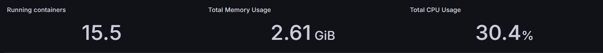
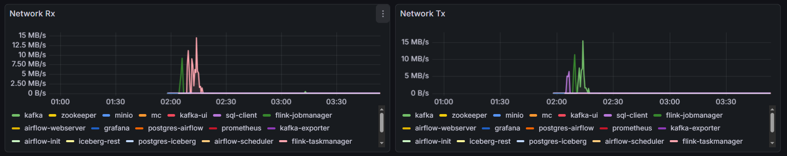
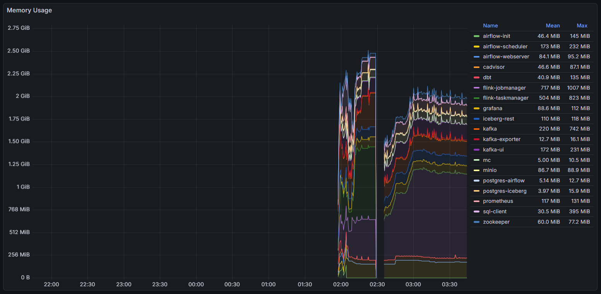

# Monitoring & Observability

This setup adds monitoring and observability capabilities to the event-streaming platform using Prometheus and Grafana.

The monitoring stack provides visibility into:
- Kafka metrics
- Flink metrics
- Docker container resource usage
- Aggregated streaming insights

---

# Included Components

- Prometheus
- Grafana
- Kafka Exporter
- cAdvisor

---

# Features

- Automatic Prometheus datasource provisioning
- Automatic Grafana dashboard provisioning
- Kafka monitoring integration
- Flink metrics scraping
- Docker containers monitoring

---

# Dashboards

## Aggregation Dashboard

---

## Running Containers Dashboard

---

## CPU Usage Dashboard

---

## Memory Usage Dashboard
